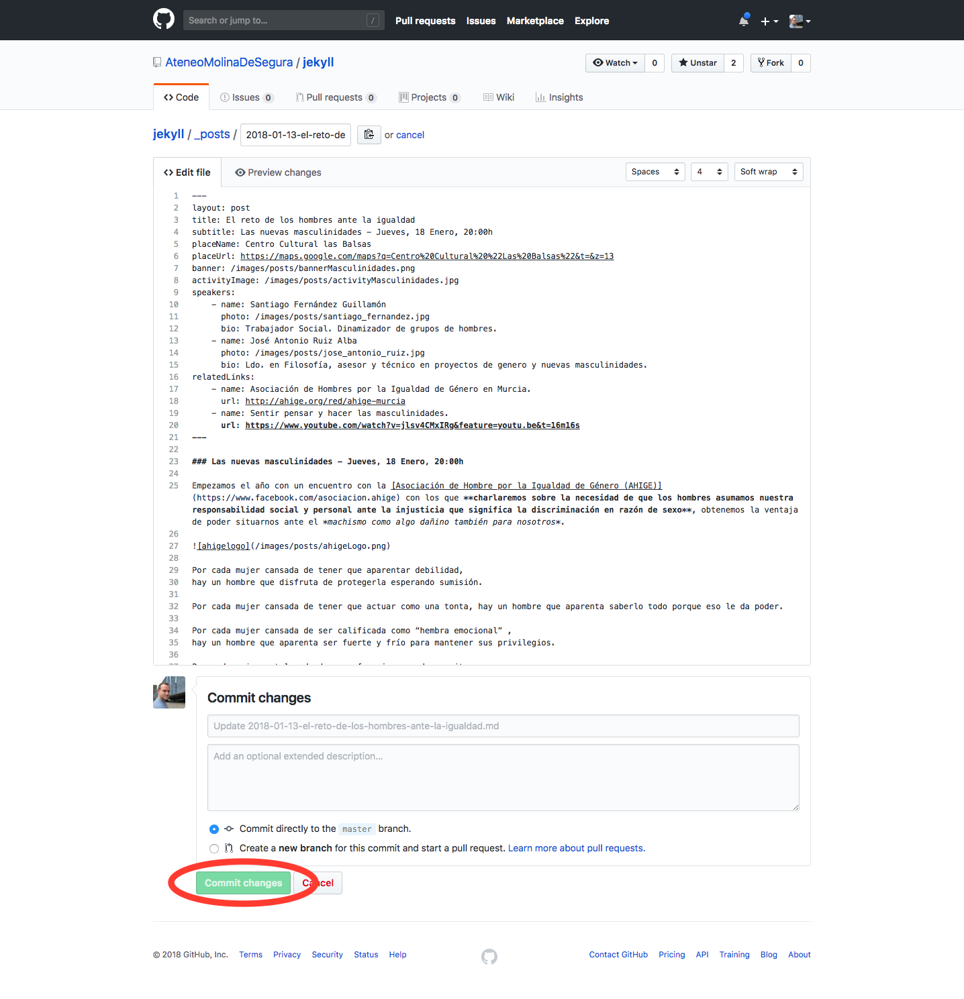

#  Ateneo Molina de Segura

Repositorio de código de la página web del Ateneo Villa de Molina de Segura [https://ateneomolinadesegura.github.io](https://ateneomolinadesegura.github.io).

Este repositorio contiene un sitio web estático generado con [Jekyll](https://jekyllrb.com/). Gestionado como un proyecto open source desde su nacimiento y bajo una [licencia](./LICENSE) GNU General Public License v3.0 este proyecto evolucionará gracias a los miembros de [nuestra organización](https://github.com/orgs/AteneoMolinaDeSegura/people).

Si quieres colaborar en la edición y mantenimiento de este proyecto no dudes en enviarnos tus pull requests o solicitar una invitación a la organización enviando un email a [ateneomolinadesegura@gmail.com](mailto://ateneomolinadesegura@gmail.com).

# ¿Cuándo y como se actualiza la web?

La web se actualiza de forma automática (puede tardar unos minutos) cada vez cualquier archivo cambia, se añade o elimina en la rama principal del proyecto. Si se edita el contenido de algún post desde la web de GitHub manualmente, se añade un commit a la rama ``master`` diréctamente o se envía una pull request contra ``master`` la web se actualizará automáticamente.

# Participar añadiendo o editando contenido

Lo primero que debemos tener en cuenta es que para poder añadir o modificar contenido en la web del Ateneo de Molina de Segura es que debemos crear una cuenta gratuita en [GitHub](https://github.com/). Gracias a esta cuenta podremos tener control sobre las colaboraciones que se hacen al proyecto y los autores de las mismas manteniendo el espíritu open source del proyecto :smiley:

Puedes crear tu cuenta de GitHub desde este [enlace](https://github.com/join?source=header-home). Aunque se puede seleccionar un plan de pago en el proceso de registro, nosotros solo necesitaremos un plan gratuito.


Tras el proceso de registro recibirás un email para verificar tu cuenta. **Recuerda verificar tu cuenta, este paso es obligatorio y si no lo haces no podrás contribuir al proyecto**. Si pones una foto de perfil y un nombre nos ayudará bastante a comunicarnos durante las diferentes etapas de la colaboración.

Lo último, pero no por ello lo más importante, debes enviar un email a [ateneomolinadesegura@gmail.com](mailto://https://github.com/join?source=header-home) solicitando la admisión en la organización que hemos creado para Ateneo Molina de Segura. Esto te permitirá colaborar diréctamente sobre el proyecto sin realizar ningún fork de nuestros repositorios. Si tienes conocimientso de informática suficientes como para mantener tu propio fork del proyecto y enviar pull requests al repositorio principal, you are ready to go :rocket:

Una vez te enviemos la invitación a la organización Ateneo Molina de Segura en GitHub estarás listos para añadir o editar contenido en el proyecto de nuestra página web que encontrarás aquí: [https://github.com/AteneoMolinaDeSegura/jekyll](https://github.com/AteneoMolinaDeSegura/jekyll/)


# Estructura del proyecto

Este repositorio contiene un proyecto de Jekyll que podemos modificar desde la propia web de GitHub. Contiene una serie de archivos ``html``, ``png``, ``jpg`` y ``md`` que contienen la información que se muestar en la web. Podemos cambiar de forma automática cualquier contenido mostrado en la web desde nuestro navegador modificando el contenido de los ficheros, **pero modificar parte del contenido es más sencillo que otro**. **Este proyecto está pensado para que personas sin un gran conocimiento sobre desarrollo web puedan cambiar el contenido de las actividades que organiza el ateneo fácilmente**. Para ello solo tendrán que cambiar la información que aparece en los archivos ``.md`` dentro del directorio ``_posts``. A continuación detallaremos cómo añadir, editar y borrar contenido de la web junto con algo de información sobre como embeber vídeos de YouTube o imágenes que subiremos nosotros mismos.

**Disclaimer: Decidimos usar un sitio estático generado con Jekyll y que se pueda modificar desde GitHub para evitar los costes de mantenimiento asociados a servidores y derivados. Desde la organización del Ateneo creemos que estra infraestructura es suficiente por ahora para las necesidades del proyecto.**

**Ten en cuenta que tras cada modificación, un servidor externo publicará los cambios que realices en la web. Este proceso puede tardar un poco, pero será automático y transparente para los usuarios.**

La estructura del proyecto, desde el punto de vista de las personas que suben contenido o lo modifican es la siguiente:


**Si por cualquier motivo crees que no puedes realizar la modificación o la adición de contenido que tienes en mente no dudes en ponerte en contacto con cualquier otro miembro de la organización. Son muy simpáticos y te ayudarán en todo momento con todo lo que necesites ** :smiley:

# Añadir contenido a la web

El proyecto está pensando para que añadamos actividades de forma sencilla y repetitiva. Para añadir otro tipo de páginas, por favor ponte en contacto con el resto de la organización. Este tipo de modificaciones no son sencillas.

**Consejo: Cuando tengas que crear una actividad nueva no escribas el archivo ``.md`` de la actividad desde cero. Copia uno ya existente y modifica su contenido. Esto te ayudará a cometer menos errores.**

Lo primero que debemos hacer cuando queramos añadir una actividad es subir las imágenes que vamos a utilizar. Para ello lo que haremos será subir contenido a la carpeta ``images/posts`` con un nombre de fichero que no se haya usado previamente.

Puedes acceder a la carpeta de imágenes pusando desde la página principal del repositorio en la carpeta llamada ``images`` o haciendo click en este enlace: [https://github.com/AteneoMolinaDeSegura/jekyll/tree/master/images](https://github.com/AteneoMolinaDeSegura/jekyll/tree/master/images)

***ES MUY IMPORTANTE QUE NOS NOMBRES DE LAS FOTOS NO CONTENGAN ESPACIOS EN BLANCO***

Una vez dentro de la carpeta llamada ``images`` solo tendrás que pulsar el boton ``Subir archivos``:


Al hacer click en el enlace o en la carpeta de llamada ``images`` llegarás a esta pantalla:


Luego solo tendrás que seleccionar el archivo que quieres subir y pulsar el botón ``commit``:


**Recuerda que por cada actividad deberás subir como mínimo una foto grande que se utilice como banner en la pantalla principal de la web y otra pequeña que se use en el cuadro de la actividad en la pantalla donde pueden verse todas las actividades**. Adicionalmente puedes subir una imágen de perfil por cada uno de los ponentes que participen en la actividad.

Una vez subidas las imágenes podrás hacer referencia a ellas desde los archivos de las actividades de la siguiente forma

```

```

Si subimos una foto llamada ``pedroGomez.png`` la podremos referenciar en los ficheros de las actividades de la siguiente forma:

```

```

**Una vez hemos subido las fotos estamos listos para crear nuestro fichero de actividad**

Cada actividad tiene un fichero asociado en la carpeta ``_posts``. Cuando creamos un fichero nuevo la pantalla principal de la web se actualiza para mostrar información de este fichero sin que tengamos que hacer nada. La pantalla de actividades también se actualiza mostrando una nueva actividad en la lista.

Podemos crear los ficheros de las atividades haciendo click en la carptea ``_posts`` o en el siguiente enlace: [https://github.com/AteneoMolinaDeSegura/jekyll/tree/master/_posts](https://github.com/AteneoMolinaDeSegura/jekyll/tree/master/_posts). Esto nos llevará a la siguiente pantalla:


Este directorio contendrá un fichero por cada actividad listada [en la página de actividades de nuestra web](https://ateneomolinadesegura.github.io/actividades).

Para añadir una actividad pulsaremos en el botón ``Crear nuevo archivo``.


Que nos mostrará la siguiente pantalla:


**El nombre que le pongamos al fichero en esta pantalla es muy importante. Tiene que tener el siguiente formato y no puede contener espacios**:

```
2018-01-01-el-reto-de-los-hombres-ante-la-igualdad.md

2018-01-31 // Fecha en la que publicamos la actividad, normalmente la fecha de hoy o un día pasado en formato AÑO-MES-DIA 

-el-reto-de-los-hombres-ante-la-igualdad // Nombre de la actividad separado por guiones y sin símbolos de puntuación.

.md // Extensión del fichero. Tiene que acabar en .md obligatoriamente
```

**Una vez tengamos el nombre del fichero es hora de ir a por el contenido**.

A continuación encontrarás un ejemplo de un fichero de actividad.

```markdown
---
layout: post
permalink: el-reto-de-los-hombres-ante-la-igualdad
title: El reto de los hombres ante la igualdad
subtitle: Las nuevas masculinidades - Jueves, 18 Enero 2018, 20:00h
placeUrl: https://maps.google.com/maps?q=Centro%20Cultural%20%22Las%20Balsas%22&t=&z=13
banner: /images/posts/bannerMasculinidades.png
activityImage: /images/posts/activityMasculinidades.jpg
speakers: 
    - name: Santiago Fernández Guillamón
      photo: /images/posts/santiago_fernandez.jpg
      bio: Trabajador Social. Dinamizador de grupos de hombres.
    - name: José Antonio Ruiz Alba
      photo: /images/posts/jose_antonio_ruiz.jpg
      bio: Ldo. en Filosofía, asesor y técnico en proyectos de genero y nuevas masculinidades.
relatedLinks: 
    - name: Asociación de Hombres por la Igualdad de Género en Murcia.
      url: http://ahige.org/red/ahige-murcia
    - name: Sentir pensar y hacer las masculinidades.
      url: https://www.youtube.com/watch?v=jlsv4CMxIRg&feature=youtu.be&t=16m16s
---

### Las nuevas masculinidades - Jueves, 18 Enero, 20:00h

Empezamos el año con un encuentro con la [Asociación de Hombre por la Igualdad de Género (AHIGE)](https://www.facebook.com/asociacion.ahige) con los que **charlaremos sobre la necesidad de que los hombres asumamos nuestra responsabilidad social y personal ante la injusticia que significa la discriminación en razón de sexo**, obtenemos la ventaja de poder situarnos ante el *machismo como algo dañino también para nosotros*.


Por cada mujer cansada de tener que aparentar debilidad,
hay un hombre que disfruta de protegerla esperando sumisión.

***

### Vídeos relacionados


***
```

Dentro de estos ficheros encontrarás una cabecera que contiene metadatos sobre el evento y que se usa en la página principal o la página de actividades para mostrar información sobre el mismo. Todos los metadatos se encuentran dentro de los caracteres ```---```. Aquí tienes una lista de lo que significa cada elemento:

```
layout: post // TIENE QUE SER OBLIGATORIAMENTE ASÍ
permalink: el-reto-de-los-hombres-ante-la-igualdad // ENLACE QUE HARÁ REFERENCIA A LA PÁGINA DE LA ACTIIDAD www.ateneomolinadesegura.com/el-reto-de-los-hombres-ante-la-igualdad
title: El reto de los hombres ante la igualdad // TÍTULO DE LA PÁGINA PRINCIPAL Y EL DETALLE DE LA ACTIVIDAD
subtitle: Las nuevas masculinidades - Jueves, 18 Enero 2018, 20:00h  // SUBTÍTULO DE LA PÁGINA PRINCIPAL Y EL DETALLE DE LA ACTIVIDAD
placeUrl: https://maps.google.com/maps?q=Centro%20Cultural%20%22Las%20Balsas%22&t=&z=13 // URL DE GOOGLE MAPS A LA QUE ENLAZAMOS EL BOTÓN "Cómo llegar"
banner: /images/posts/bannerMasculinidades.png // DIRECCIÓN DE LA IMÁGEN DE BANNER QUE HEMOS SUBIDO PREVIAMENTE. 
activityImage: /images/posts/activityMasculinidades.jpg // DIRECCIÓN DE LA IMÁGEN DE BANNER QUE HEMOS SUBIDO PREVIAMENTE
speakers: // INFORMACIÓN DE LOS SPEAKERS QUE PARTICIPAN
    - name: Santiago Fernández Guillamón
      photo: /images/posts/santiago_fernandez.jpg
      bio: Trabajador Social. Dinamizador de grupos de hombres.
    - name: José Antonio Ruiz Alba
      photo: /images/posts/jose_antonio_ruiz.jpg
      bio: Ldo. en Filosofía, asesor y técnico en proyectos de genero y nuevas masculinidades.
relatedLinks: // INFORMACIÓN DE LOS ENLACES RELACIONADOS 
    - name: Asociación de Hombres por la Igualdad de Género en Murcia.
      url: http://ahige.org/red/ahige-murcia
    - name: Sentir pensar y hacer las masculinidades.
      url: https://www.youtube.com/watch?v=jlsv4CMxIRg&feature=youtu.be&t=16m16s
```

Si por algún motivo no hay speakers o enlaces relacionados puedes borrar estas partes del fichero.

El resto del fichero contiene la información que se mostrará en la página de detalle de la actividad. **Esta parte del fichero está escrita utilizando un lenguaje llamado markdown que nos permite añadir imágenes negritas y enlaces tal y como te indico a continuación**:

```markdown
//Añadir un enlace:

[nombreDelEnalce](https://cualquierenlace.com)

//Marcar texto en cursiva

Esto es un texto *en cursiva*.

//Marcar texto en negrita

Esto es un texto **importante**.

//Añadir una foto:


//Escribir un título:

# Título

//Escribir un subtítulo:

## Subtítulo

//Hacer una lista de elementos:

* Elemento 1
* Elemento 2
* Elemento 3
  * Elemento 3.1

//Escribir una cita:

> Mi cita célebre.

//Añadir un separador:

***

//Añadir un vídeo de youtube



```

**Podrás encontrar más información sobre cómo usar elementos de markdown a parte de esta en el [siguiente enlace](https://markdown.es/sintaxis-markdown/)**.

Una vez tengas el contenido listo y escrito puedes añadirlo al campo de texto donde va el contenido del fichero y pulsar el botón ``commit``. **Tras unos minutos la web será actualizada y podrás ver tu contenido en el enlace que configuraste**


**Tras unos minutos la web se actualizará cambiando la portada si la actividad que has añadido es la más reciente en el tiempo, añadiendo una nueva actividad a la pantalla de actividades y teniendo su contenido disponible en el enlace que configuraste**

# Modificar el contenido de la web

Para modificar el contenido de la web lo único que tienes que hacer es hacer log in con tu usuario de GitHub, seleccionar el archivo que quieres cambiar, pulsar el botón de editar, y tras realizar tus cambios pulsar el botón de que dice ``commit``. Encontrarás los ficheros que contienen la información sobre las actividades en el directorio llamado ``_post``.


Una vez modificado el contenido del archivo, podrás guardar los cambios pulsando el botón ``commit`` al final de la página.



La página se actualizará en unos minutos.

# Eliminar contenido de la web

Para borrar una actividad de la web solo tenemos que borrar el archivo asociado a la actividad en la carpeta ``_posts`` o ``images`` 


# Ejecutar este proyecto

Si necesitas modificar parte del código fuente que no está relacionado con las publicaciones y tienes que probar las modificaciones de las plantillas o cualquier otro elemento recuerda que puedes hacerlo fácilmente clonando este repositorio, instalando Ruby 2.X y Jekyll. Recuerdas que el contenido se puede añadir y modificar sin ningún tipo de software necesario más que un navegador como Google Chrome o Safari.

```
// Clonar el proyecto
git clone https://github.com/AteneoMolinaDeSegura/ateneomolinadesegura.github.io 
cd ateneomolinadesegura.github.io

// Actualizar Ruby, bundler y jekyll
curl -L https://get.rvm.io | bash -s stable
rvm install ruby-2.4.1
rvm use ruby-2.4.1
rvm --default use 2.4.1
gem install bundler jekyll

// Lanzar el servidor de desarrollo en el puerto 4000
// Tras ejecutar el comando podrás acceder a la web en [localhost:4000](localhost:4000)
bundle exec jekyll serve --livereload

// Construir el proyecto. Tras la ejecución de este comando la carpeta _site contendrá los archivos
// que compondrán nuestro sitio web
bundle exec jekyll build 
```

En esta web encontrarás algo de información sobre cómo utilizar las plantillas o algunos comandos útiles [aquí](https://devhints.io/jekyll).
